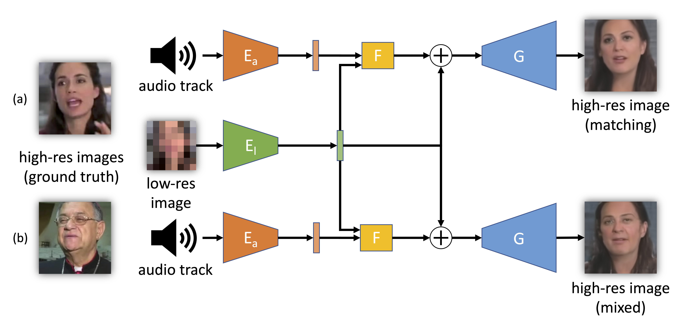

  <a href="https://gmeishvili.github.io" style="font-size: 21px; text-decoration: none">Givi Meishvili</a> 
  &nbsp; &nbsp; &nbsp; &nbsp; &nbsp; &nbsp; &nbsp;  
  <a href="https://sjenni.github.io" style="font-size: 21px; text-decoration: none">Simon Jenni</a> 
  &nbsp; &nbsp; &nbsp; &nbsp; &nbsp; &nbsp; &nbsp;  
  <a href="http://www.cvg.unibe.ch/people/favaro" style="font-size: 21px; text-decoration: none">Paolo Favaro</a>

  <a href="https://arxiv.org/abs/1909.12780" style="font-size: 21px; text-decoration: none">[Paper]</a>
  &nbsp; &nbsp; &nbsp; &nbsp; &nbsp; &nbsp; &nbsp;  
  <a href="https://github.com/gmeishvili/deblur_and_rotate_motion_blurred_faces" style="font-size: 21px; text-decoration: none">[GitHub]</a> 

  

***Simplified training and operating scheme of the proposed model.*** *The model can be used (a) with matching inputs or (b) by mixing low-resolution images with audios from other videos. The low-resolution image (8 × 8 pixels) is fed to an encoder El to obtain an intermediate latent representation. A residual is computed by fusing in the network F the encoded audio track (through the encoder Ea) with the encoded low-resolution image. The residual is used to update the latent representation of the low-resolution image and then produce the high-resolution image through the generator G.*

___

# Abstract

We propose a solution to the novel task of rendering sharp videos from new view-points from a single motion-blurred image of a face. Our method handles the complexityof face blur by implicitly learning the geometry and motion of faces through the jointtraining on three large datasets: FFHQ and 300VW, which are publicly available, and anew multi-view face dataset that we built, which will be made available upon publication.The first two datasets provide a large variety of faces and allow our model to generalizebetter. The third dataset instead allows us to introduce multi-view constraints, which arecrucial to synthesizing sharp videos from a new camera view.  Our dataset consists ofhigh frame rate synchronized videos from multiple views of several subjects displayinga wide range of facial expressions.  We use the high frame rate videos to simulate real-istic motion blur through averaging.  Thanks to this dataset, we train a neural networkto reconstruct a 3D video representation from a single image and the corresponding facegaze.  We then provide a camera viewpoint relative to the estimated gaze and the blurryimage as input to an encoder-decoder network to generate a video of sharp frames with anovel camera viewpoint. We demonstrate our approach on test subjects of our multi-viewdataset and VIDTIMIT.

___

# Results

    

***Example sharp video reconstructions from our model.*** *We show reconstructed frame sequences without viewpoint change (odd columns) and with random viewpoint changes (even columns). The first row shows the blurry input image followed by landmarks computed on the first and last frame in the reconstructed sequence. The first three examples are computed on VIDTIMIT and the last two on our test set.*