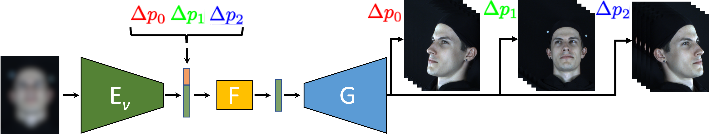

  <a href="https://gmeishvili.github.io" style="font-size: 21px; text-decoration: none">Givi Meishvili</a> 
  &nbsp; &nbsp; &nbsp; &nbsp; &nbsp; &nbsp; &nbsp;
  <a href="https://www.linkedin.com/in/the-real-attila-szabo/?originalSubdomain=ch" style="font-size: 21px; text-decoration: none">Attila Szabo</a> 
  &nbsp; &nbsp; &nbsp; &nbsp; &nbsp; &nbsp; &nbsp;  
  <a href="https://sjenni.github.io" style="font-size: 21px; text-decoration: none">Simon Jenni</a> 
  &nbsp; &nbsp; &nbsp; &nbsp; &nbsp; &nbsp; &nbsp;  
  <a href="http://www.cvg.unibe.ch/people/favaro" style="font-size: 21px; text-decoration: none">Paolo Favaro</a>

  <a href="" style="font-size: 21px; text-decoration: none">[Paper]</a>
  &nbsp; &nbsp; &nbsp; &nbsp; &nbsp; &nbsp; &nbsp;  
  <a href="https://github.com/gmeishvili/deblur_and_rotate_motion_blurred_faces" style="font-size: 21px; text-decoration: none">[GitHub]</a> 

  

***Overview of our system during inference.*** *The encoder Ev encodes a blurry image into a sequence of latent codes that are then manipulated based on the relative viewpoints via the fusion network F to produce encodings of images from a novel view. Finally, the generator G maps the novel view encodings to the image space.*

___

# Abstract

We propose a solution to the novel task of rendering sharp videos from new view-points from a single motion-blurred image of a face. Our method handles the complexity of face blur by implicitly learning the geometry and motion of faces through the joint training on three large datasets: FFHQ and 300VW, which are publicly available, and a new multi-view face dataset that we built, which will be made available upon publication. The first two datasets provide a large variety of faces and allow our model to generalize better. The third dataset instead allows us to introduce multi-view constraints, which are crucial to synthesizing sharp videos from a new camera view.  Our dataset consists of high frame rate synchronized videos from multiple views of several subjects displaying a wide range of facial expressions.  We use the high frame rate videos to simulate real-istic motion blur through averaging.  Thanks to this dataset, we train a neural network to reconstruct a 3D video representation from a single image and the corresponding face gaze.  We then provide a camera viewpoint relative to the estimated gaze and the blurry image as input to an encoder-decoder network to generate a video of sharp frames with anovel camera viewpoint. We demonstrate our approach on test subjects of our multi-view dataset and VIDTIMIT.

___

# Results

    

***Example sharp video reconstructions from our model.*** *We show reconstructed frame sequences without viewpoint change (odd columns) and with random viewpoint changes (even columns). The first row shows the blurry input image followed by landmarks computed on the first and last frame in the reconstructed sequence. The first three examples are computed on VIDTIMIT and the last two on our test set.*